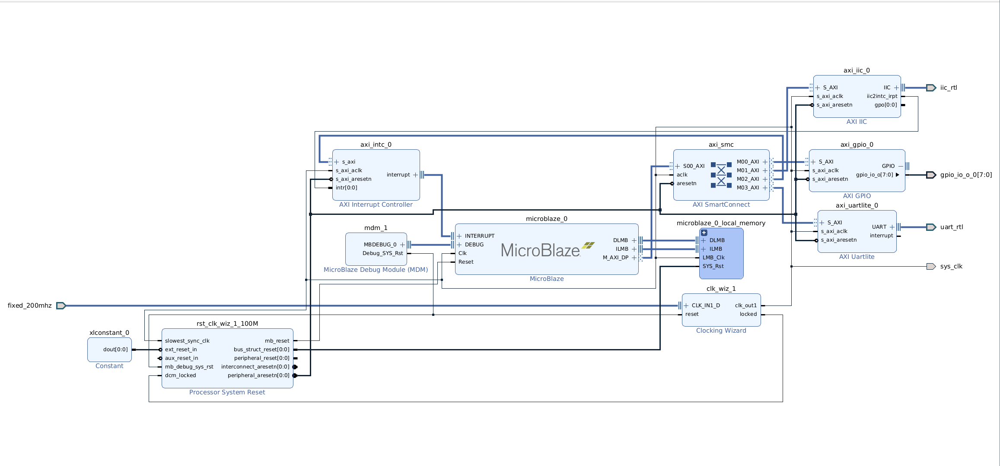

# **QEMU for Xilinx MicroBlaze**

Xilinx's documentation is outdated for newer versions of Vitis, making it challenging to set up QEMU for MicroBlaze. This repository provides a step-by-step tutorial on how to build and use QEMU for MicroBlaze, tested with Vivado 2024.2.

---

## **Why Use QEMU to Run MicroBlaze?**

QEMU (Quick Emulator) is an open-source emulator supporting multiple CPU architectures, including Xilinx MicroBlaze. When developing MicroBlaze applications, using QEMU for emulation provides several benefits:

### **1. Develop Without Hardware – More Convenient**
The MicroBlaze processor typically runs on FPGAs (e.g., Xilinx 7 Series or UltraScale+). However, real hardware can be:
- **Expensive** (requires an FPGA evaluation board)
- **Difficult to debug** (needs a JTAG connection)
- **Resource-intensive** (occupies FPGA resources)

QEMU provides a fully software-based environment, allowing you to develop and test MicroBlaze code on a PC without requiring actual FPGA hardware.  

### **2. Faster Debugging – Saves Time**
Running MicroBlaze on real FPGA hardware involves:
- Re-synthesizing and implementing the design for every change
- Flashing the FPGA, which is time-consuming

With QEMU:
- You can execute code instantly without FPGA flashing
- It supports remote debugging with GDB
- Snapshots allow restoring simulation states

This significantly enhances development efficiency!

### **3. Compatible with Xilinx SDK/Vitis Tools**
QEMU provides MicroBlaze instruction set simulation, enabling:
- Running ELF files generated by Xilinx SDK/Vitis
- Testing embedded applications such as FreeRTOS and the Linux Kernel

---

## **How to Set Up QEMU for MicroBlaze**

Follow the steps below to build and configure QEMU for MicroBlaze.

### **1. Clone and Build QEMU**

```sh
git clone git://github.com/Xilinx/qemu.git
cd qemu
git checkout tags/xilinx_v2024.2
sudo apt install libglib2.0-dev libgcrypt20-dev zlib1g-dev autoconf automake libtool bison flex libpixman-1-dev
git submodule update --init dtc
mkdir build
cd build
../configure --target-list="aarch64-softmmu,microblazeel-softmmu" --enable-fdt --disable-kvm --disable-xen --enable-gcrypt
make -j4
```

### **2. Create the Block Design in Vivado (Tcl Script)**

Run the following command in Vivado:
```sh
source design_1.tcl
```



Complete all necessary steps before exporting hardware and launching Vitis.

### **3. Create an Application Using Vitis**
- Create a **Platform Component**
- Generate **"Hello World"** and **"Peripheral Test"** applications from **Embedded Software Examples**
- Build the ELF files

### **4. Generate the Device Tree (DTB)**

#### **4.1 Clone the Xilinx Device Tree Repository**

```sh
git clone https://github.com/Xilinx/device-tree-xlnx.git
cd device-tree-xlnx
git checkout tags/xilinx_v2024.2
```

#### **4.2 Generate the Device Tree Source (DTS) File**

Run `xsct` in the terminal and execute the following commands:
```sh
hsi open_hw_design design_1_wrapper.xsa
hsi set_repo_path <PATH TO device-tree-xlnx>
hsi create_sw_design device-tree -os device_tree -proc microblaze_0
hsi generate_target -dir my_dts/
```

This will create a **my_dts/** folder containing:
```sh
$ ls my_dts/
device-tree.mss  include  pl.dtsi  system-top.dts
```

**⚠ Note:** The device tree source files in the Xilinx installation directory (`Xilinx/Vitis/2024.2/data/system-device-tree-xlnx`) may not work, often resulting in errors like:  
```sh
ERROR: [Hsi 55-1594] Core device_tree of version not found in repositories
ERROR: [Hsi 55-1447] Error: running create_sw_design.
ERROR: [Common 17-39] 'hsi::create_sw_design' failed due to earlier errors.
```

#### **4.3 Convert the DTS to DTB**

```sh
cd my_dts
gcc -I my_dts -E -nostdinc -I include -undef -D__DTS__ -x assembler-with-cpp -o system.dts system-top.dts
dtc -I dts -O dtb -o system.dtb system.dts
```

To verify the generated **system.dtb**, convert it back to DTS:
```sh
dtc -I dtb -O dts -o system.dts system.dtb
```
The output should match `system-top.dts`.

---

### **5. Run QEMU**

Execute the following command:
```sh
qemu-system-microblazeel -M microblaze-fdt -serial mon:stdio -display none -kernel peripheral_tests.elf -dtb my_dts/system.dtb
```
Ensure that the paths for `qemu-system-microblazeel`, `peripheral_tests.elf`, and `system.dtb` are correct.

#### **Expected Output (Successful Execution)**

```sh
$ qemu-system-microblazeel -M microblaze-fdt-plnx -serial mon:stdio -display none -kernel hello_world.elf -dtb my_dts/system.dtb
Hello World
Successfully ran Hello World application

$ qemu-system-microblazeel -M microblaze-fdt-plnx -serial mon:stdio -display none -kernel peripheral_tests.elf -dtb my_dts/system.dtb
---Entering main---

Running IntcSelfTestExample for axi_intc_0 ... 
IntcSelfTestExample PASSED 

Running GpioOutputExample for axi_gpio_0 ... 
GpioOutputExample PASSED 

Running IicSelfTestExample for axi_iic_0 ... 
IicSelfTestExample FAILED 
---Exiting main---
```

To exit QEMU, press **`Ctrl + A`** followed by **`X`**.

---

## **References**
1. [Building and Running QEMU from Source Code](https://xilinx-wiki.atlassian.net/wiki/spaces/A/pages/822312999/Building+and+Running+QEMU+from+Source+Code)
2. [Debugging Standalone Application on Microblaze using QEMU](https://xilinx-wiki.atlassian.net/wiki/x/9YIfAQ)
3. [Build Device Tree Blob](https://xilinx-wiki.atlassian.net/wiki/spaces/A/pages/18842279/Build+Device+Tree+Blob)  

---
